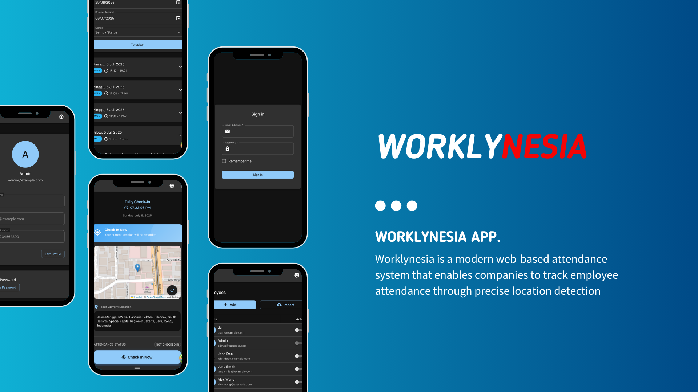
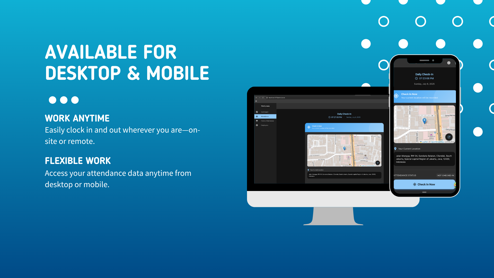

# Worklynesia

Worklynesia is a modern web-based attendance system that enables companies to track employee attendance through precise location detection. The platform ensures accurate attendance recording by verifying employee locations during check-in and check-out, supporting both remote and on-site work arrangements.

## Key Features

- **Location-Based Attendance**: GPS tracking for accurate attendance recording
- Web-based and Mobile platform accessible from any device with internet connection
- Employee self-service portal for attendance history
- Manage Employee data and attendance records from HR dashboard
- Check-in and check-out attendance

## Tech Stack

This repository is a Turborepo monorepo powered by:

- React.js for the `dashboard` application (employee and HR include one dashboard)
- Zustand for state management
- Material UI
- Turborepo for build orchestration
- Kafka
- PostgreSQL
- Prisma
- Nest js
- Docker
- React Router
- Vite

## Repository Structure

```text
apps/
  attendance-service/    # Attendance Service
  notification-service/  # Notification Service
  api-gateway/           # API Gateway
  user-service/          # User Service
  auth-service/          # Auth Service
  dashboard/             # Dashboard
packages/
  common/                # Common packages
  eslint-config/
  tsconfig/
```

## Getting Started

1. Install dependencies:

   ```bash
   pnpm install
   ```

2. Copy environment variables:

   ```bash
   cp .env.example .env
   ```

3. Run Docker Compose for kafka and postgres:

   ```bash
   docker compose up -d
   ```

4. Clone the logging service repository:

   ```bash
   git clone https://github.com/mchafiz/worklynesia-logging.git
   cd worklynesia-logging
   pnpm install
   docker-compose up -d
      npx prisma generate
   npx prisma migrate dev
   ```

5. Run Prisma Migrations:

   ```bash
   npx prisma generate
   npx prisma migrate dev
   ```

6. Build Package Common:

   ```bash
   pnpm run build:common
   ```

7. Run all apps in development mode:

   ```bash
   pnpm run dev:all
   ```

Access the applications:

- Api Gateway: http://localhost:3000
- Dashboard: http://localhost:5173

For documentation API Gateway, please refer to the [API Documentation](http://localhost:3000/api/docs).

⚠️ **Development Status**: This project is currently in active development phase. The Docker configuration is not yet fully stable for production use.
